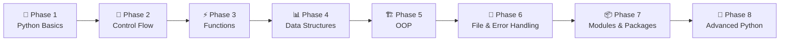

<p align="center">
  
</p>

<h1 align="center">🐍 Python Master</h1>

<p align="center">
  <strong>Complete Interactive Python Learning Platform</strong><br>
  <em>From Zero to Hero — Master Python with Hands-on Learning!</em>
</p>

<p align="center">
  
  
  
  
  
</p>

<p align="center">
  
  
  
</p>

---

## 🚀 Overview

**Python Master** is a feature-rich, beautifully designed web application that transforms Python learning into an engaging, gamified experience. Whether you're a complete beginner or brushing up your skills for job interviews, this platform has everything you need!

### ✨ Why Python Master?

| Feature | Description |
|---------|-------------|
| 🎯 **Structured Roadmap** | 8-phase learning journey from basics to advanced |
| 📚 **50+ In-depth Topics** | Comprehensive notes with real-world examples |
| 🧠 **200+ Quiz Questions** | 4 difficulty levels (Basics → Advanced) |
| ⌨️ **Coding Quiz** | Type-based answers testing real Python knowledge |
| 💼 **Career Guidance** | 10+ career paths with salary insights |
| 🏆 **Achievement System** | Unlock badges as you progress |
| 🔥 **Streak Tracking** | Daily learning streak counter |
| 🌙 **Dark/Light Mode** | Eye-friendly themes |
| 📱 **Fully Responsive** | Works on all devices |
| 💾 **Progress Saving** | Export/Import your learning data |

---

## 📸 Screenshots

<p align="center">
  
</p>

---

## 🗺️ Learning Roadmap



| Phase | Topics Covered | Duration |
|-------|---------------|----------|
| **Phase 1** | Variables, Data Types, Operators, Input/Output | Week 1-2 |
| **Phase 2** | Conditionals, Loops, Break/Continue, Match-Case | Week 2-3 |
| **Phase 3** | Functions, Lambda, Decorators, Scope | Week 3-4 |
| **Phase 4** | Lists, Tuples, Dictionaries, Sets, Comprehensions | Week 4-5 |
| **Phase 5** | Classes, Inheritance, Polymorphism, Encapsulation | Week 5-6 |
| **Phase 6** | File Operations, JSON, Exception Handling, Logging | Week 6-7 |
| **Phase 7** | Importing, Modules, pip, Virtual Environments | Week 7-8 |
| **Phase 8** | Generators, Async, Multithreading, Projects | Week 8-10 |

---

## 📚 Topics Covered

<details>
<summary><strong>🎯 Python Basics</strong></summary>

- Variables & Data Types
- Operators (Arithmetic, Logical, Comparison)
- Input & Output
- Strings & String Methods
- Comments & Documentation

</details>

<details>
<summary><strong>🔀 Control Flow</strong></summary>

- If-Else Statements
- Elif Ladder
- Nested Conditions
- For Loops
- While Loops
- Break, Continue, Pass
- Match-Case (Python 3.10+)

</details>

<details>
<summary><strong>⚡ Functions</strong></summary>

- Function Definition
- Parameters & Arguments
- Return Values
- Lambda Functions
- Decorators
- Recursion
- Scope & Closures

</details>

<details>
<summary><strong>📊 Data Structures</strong></summary>

- Lists & List Methods
- Tuples
- Dictionaries
- Sets
- List Comprehensions
- Dictionary Comprehensions
- Nested Data Structures

</details>

<details>
<summary><strong>🏗️ Object-Oriented Programming</strong></summary>

- Classes & Objects
- Constructors (`__init__`)
- Instance & Class Variables
- Inheritance
- Multiple Inheritance
- Polymorphism
- Encapsulation
- Magic Methods

</details>

<details>
<summary><strong>📁 File & Error Handling</strong></summary>

- File Reading & Writing
- Working with CSV/JSON
- Try-Except Blocks
- Multiple Exceptions
- Finally Clause
- Custom Exceptions
- Logging Module

</details>

<details>
<summary><strong>📦 Modules & Packages</strong></summary>

- Importing Modules
- Creating Custom Modules
- Python Packages
- pip Package Manager
- Virtual Environments
- Requirements.txt

</details>

<details>
<summary><strong>🚀 Advanced Python</strong></summary>

- Generators & Iterators
- Async/Await
- Multithreading
- Multiprocessing
- Regular Expressions
- Database Operations
- API Development

</details>

---

## 🧠 Quiz System

### 📝 MCQ Quiz (4 Levels)

| Level | Icon | Questions | Topics |
|-------|------|-----------|--------|
| **Basics** | 🟢 | 50 | Variables, Operators, Strings, I/O |
| **Medium** | 🟡 | 50 | Loops, Functions, Lists, Dictionaries |
| **Hard** | 🟠 | 50 | OOP, Files, Exceptions, Modules |
| **Advanced** | 🔴 | 50 | TCS NQT / Cognizant Level Questions |

### ⌨️ Coding Quiz
- **20 Questions** where you type the output
- Tests real Python execution knowledge
- Immediate feedback with correct answers

---

## 💼 Career Paths After Python

| Career | Salary Range (India) | Key Skills |
|--------|---------------------|------------|
| 🌐 Web Developer | ₹5-15 LPA | Django, Flask, FastAPI |
| 📊 Data Analyst | ₹6-18 LPA | Pandas, NumPy, Matplotlib |
| 🤖 ML Engineer | ₹10-30 LPA | TensorFlow, PyTorch, Scikit-learn |
| 🔬 Data Scientist | ₹12-35 LPA | Statistics, ML, Deep Learning |
| ⚙️ DevOps Engineer | ₹8-25 LPA | Docker, Kubernetes, AWS |
| 🔐 Cybersecurity | ₹8-25 LPA | Ethical Hacking, Automation |
| 🎮 Game Developer | ₹6-20 LPA | Pygame, Unity with Python |
| 📱 App Developer | ₹5-15 LPA | Kivy, BeeWare |
| 🏠 IoT Developer | ₹6-18 LPA | Raspberry Pi, Sensors |
| 💰 Quant Developer | ₹15-50 LPA | Algorithmic Trading |

---

## 🏆 Achievement System

Unlock badges as you learn and complete challenges!

| Badge | Achievement | Requirement |
|-------|------------|-------------|
| 🌱 | First Step | Complete 1 topic |
| 📚 | Bookworm | Complete 10 topics |
| 🎓 | Scholar | Complete 25 topics |
| 🏅 | Master | Complete all topics |
| 🧠 | Quiz Starter | Complete first quiz |
| 💯 | Perfect Score | Get 100% on any quiz |
| 🔥 | On Fire | 7-day streak |
| ⚡ | Unstoppable | 30-day streak |

---

## 🛠️ Tech Stack

| Technology | Purpose |
|------------|---------|
|  | Structure |
|  | Styling & Animations |
|  | Interactivity & Logic |
|  | Icons |
|  | Typography (Poppins) |

---

## 🚀 Getting Started

### Prerequisites
- Modern web browser (Chrome, Firefox, Edge, Safari)
- No installation required!

### Installation

1. **Clone the repository**
   ```bash
   git clone https://github.com/yourusername/python-master.git
   ```

2. **Navigate to project folder**
   ```bash
   cd python-master
   ```

3. **Open in browser**
   ```bash
   # Simply open index.html in your browser
   # Or use Live Server extension in VS Code
   ```

### 🌐 Online Demo
[**Live Demo**](#) ← Coming Soon!

---

## 📁 Project Structure

```plaintext
python-master/
├── 📄 index.html          # Main HTML file
├── 🎨 style.css           # All CSS styling (2800+ lines)
├── ⚡ script.js           # JavaScript logic (13000+ lines)
├── 🐍 python-logo.png     # Python logo asset
└── 📖 README.md           # This file
```

---

## ⌨️ Keyboard Shortcuts

| Key | Action |
|-----|--------|
| `ESC` | Close modal/popup |
| `?` | Get random Python tip |
| `→` | Next question (in quiz) |

---

## 💾 Data Persistence

Your learning progress is automatically saved! Features include:

- ✅ **Local Storage** - Progress saved in your browser
- 📤 **Export Progress** - Download as JSON file
- 📥 **Import Progress** - Restore from backup
- 🔄 **Reset Progress** - Start fresh anytime

---

## 🌙 Theme Support

Toggle between **Dark Mode** (default) and **Light Mode** using the moon/sun icon in the navbar.

| Dark Theme | Light Theme |
|------------|-------------|
| 🌑 Eye-friendly for long sessions | ☀️ Classic bright interface |
| Default theme | Toggle from navbar |

---

## 📊 Stats & Tracking

- 📚 **Topics Completed** - Track your learning progress
- 🏆 **Achievements Unlocked** - See your badges
- 🔥 **Daily Streak** - Maintain consistency
- 📈 **Quiz Scores** - Best scores for each level

---

## 🔗 Resources Included

| Category | Resources |
|----------|-----------|
| 📖 **Documentation** | Python Official Docs, PEPs, Wiki |
| 🎥 **YouTube** | Programming with Mosh, Corey Schafer, freeCodeCamp |
| 💻 **Practice** | HackerRank, LeetCode, CodeWars |
| 📚 **Free Books** | Automate the Boring Stuff, Think Python, A Byte of Python |

---

## 🤝 Contributing

Contributions are welcome! Here's how you can help:

1. 🍴 Fork the repository
2. 🔧 Create your feature branch (`git checkout -b feature/AmazingFeature`)
3. 💾 Commit your changes (`git commit -m 'Add AmazingFeature'`)
4. 📤 Push to the branch (`git push origin feature/AmazingFeature`)
5. 🔃 Open a Pull Request

---

## 📝 Future Roadmap

- [ ] 🔊 Hindi video tutorials integration
- [ ] 🏋️ Daily coding challenges
- [ ] 📊 Analytics dashboard
- [ ] 🤝 Community forum
- [ ] 📱 Progressive Web App (PWA)
- [ ] 🏅 Leaderboard system
- [ ] 🎯 Interview preparation module

---

## 📜 License

This project is licensed under the MIT License - see the [LICENSE](LICENSE) file for details.

---

## 🙏 Acknowledgments

- 🐍 [Python Software Foundation](https://www.python.org/)
- 📚 All open-source contributors
- 🎓 Every learner using this platform

---

<p align="center">
  <strong>Made with ❤️ for Python Enthusiasts</strong>
</p>

<p align="center">
  
</p>

<p align="center">
  <sub>© 2024 Python Master. All rights reserved.</sub>
</p>
